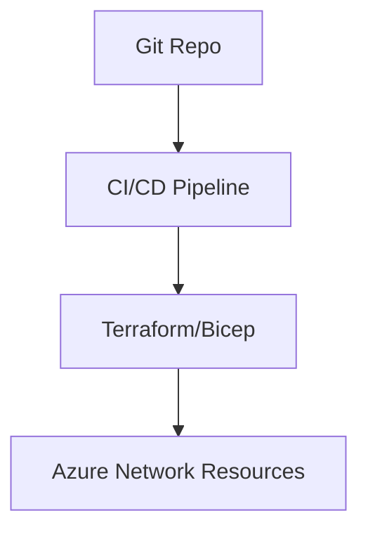

# Chapter 1: Introduction to Azure Networking

## Objective

Introduce the reader to Azure networking concepts, the evolution of networking in the cloud era, and the foundational importance of infrastructure-as-code and automation.

---

## 1. Evolution and Importance of Networking

- Traditional network roles are evolving with cloud adoption
- Networking is a foundational skill for all cloud-based architectures

---

## 2. Infrastructure as a Service (IaaS) vs Platform as a Service (PaaS)

| Feature | IaaS | PaaS |
|--------|------|------|
| Control | High | Limited |
| Responsibility | More on user | More on provider |
| Network Customization | Full | Restricted |

---

## 3. Azure Networking Certification

- AZ-700 focuses on design and implementation of Azure network services
- Key domains:
  - Design and implement core network infrastructure
  - Secure network connectivity
  - Design and implement routing
  - Monitor and troubleshoot

---

## 4. Automation and DevOps Integration

- ARM, Bicep, Terraform used to provision networking
- GitOps and CI/CD pipelines for NetOps

