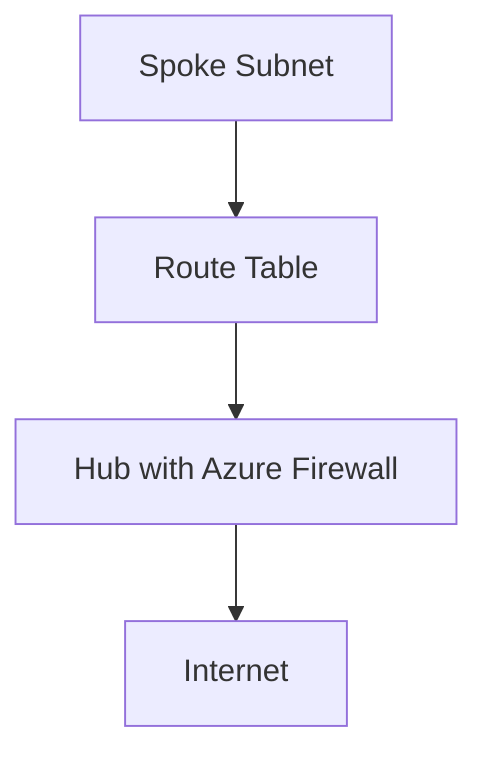

# Chapter 10: Secure Application Access and Internet Breakout

## Objective

Design application access to support both internal corporate users and remote users with secure internet breakout using Azure Firewall, ZTNA, and SSE.

## 1. Internet Egress Design

- Centralized via Azure Firewall in Hub
- Distributed via Virtual WAN Secure Hubs

## 2. Zero Trust Enforcement

- Entra ID + Conditional Access
- NSG, ASG, Firewall, JIT

## 3. Integration with AVS and Private Endpoints

- Use AVS as a secure VDI platform
- P2S + RBAC for contractor access

## 4. Secure Internet Access for Workloads

- NVA stack for advanced L7 breakout

