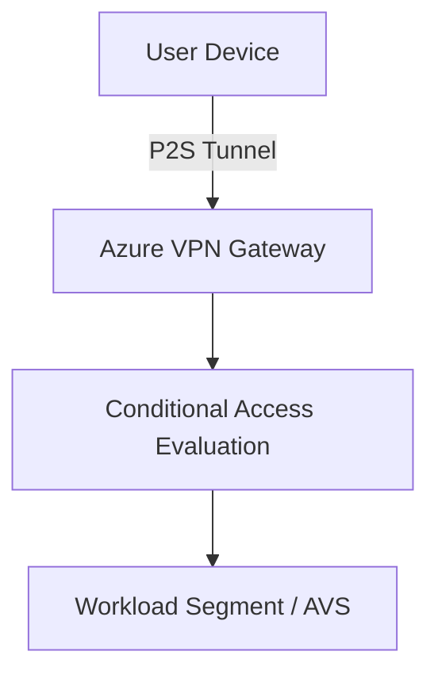

# Chapter 11: Identity-Aware Networking with Entra ID and Zero Trust

## Objective

Use Azure-native identity platforms to enforce Zero Trust access policies across hybrid networking.

## 1. Entra ID Conditional Access

- Device compliance checks
- MFA policies, Role-based access

## 2. P2S VPN with Conditional Access

## 3. JIT Access to Network Functions

- Just-in-time via Azure Security Center
- Session monitoring and audit logs

## 4. Integration with SSE and Defender for Cloud

- Threat detection
- Endpoint posture + segmentation + CA

