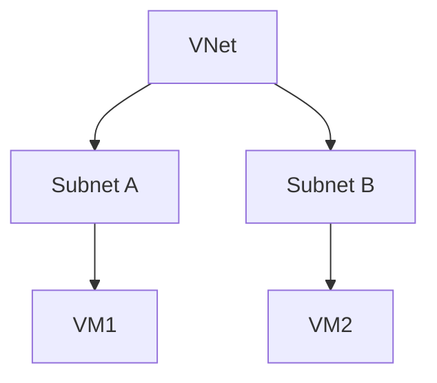
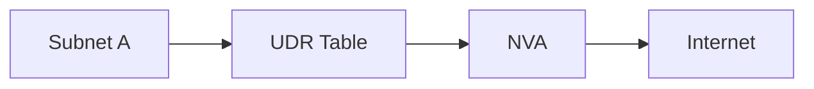
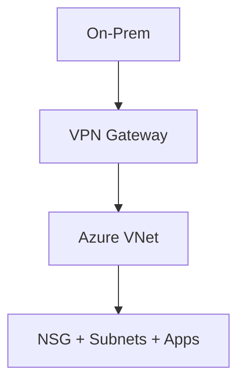

# Chapter 2: Azure Networking Fundamentals

## Objective

Cover foundational networking concepts in Azure, including virtual networks, IP addressing, routing, DNS, and load balancing.

---

## 1. Azure Virtual Networks (VNet)

- Logical isolation of cloud resources
- Subnets used to segment networks
- Connected via VNet peering or hub-and-spoke

---

## 2. IP Addressing and NICs

- Static and dynamic IP assignment
- Multiple NICs per VM for advanced routing
- Public and Private IP support

---

## 3. Routing in Azure

- System routes + User Defined Routes (UDR)
- Routes propagate between peered VNets
- Azure uses software-defined networking (SDN)

---

## 4. Load Balancing Options

| Load Balancer | Type | Use Case |
|---------------|------|----------|
| Azure Load Balancer | L4 | Intra-region traffic |
| Azure Application Gateway | L7 | Web traffic with WAF |
| Azure Front Door | Global L7 | Global HTTP/S routing |
| Traffic Manager | DNS | Geo-routing |

---

## 5. DNS in Azure

- Azure-provided DNS or custom DNS
- Private DNS Zones + Resolution across VNets

---

## 6. Security and Connectivity

- NSGs and ASGs for traffic filtering
- VPN Gateway and ExpressRoute for hybrid

