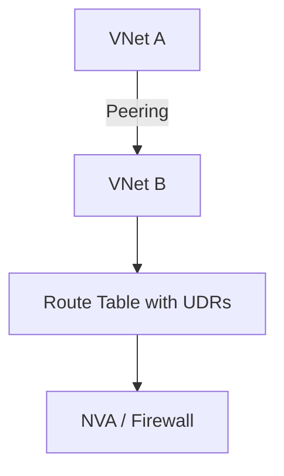
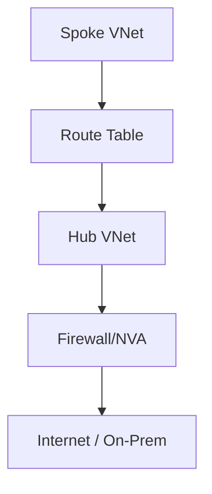

# Chapter 4: Routing and Network Segmentation in Azure

## Objective

Define scalable and secure routing strategies for hybrid and cloud-native workloads using Azure-native constructs including UDRs, NSGs, Route Tables, and NVAs.

## 1. Core Routing Constructs

- **User Defined Routes (UDRs)**
- **System Routes**
- **BGP Route Propagation**
- **Virtual Network Peering Routing Considerations**

## 2. Hub-and-Spoke Topology with Segmentation

- Central hub with inspection point (Azure Firewall / NVA)
- Spokes with route tables directing default route to hub

## 3. NSG and ASG Use Cases

- Layer 4 access control per subnet/VM
- Application groupings with ASGs

## 4. Common Patterns

| Pattern | Description |
|--------|-------------|
| Hub-and-Spoke | Centralized security and connectivity |
| Firewall Sandwich | NVA in HA pair between tiers |
| Segmented VNet | Subnets with NSG/UDR control |

