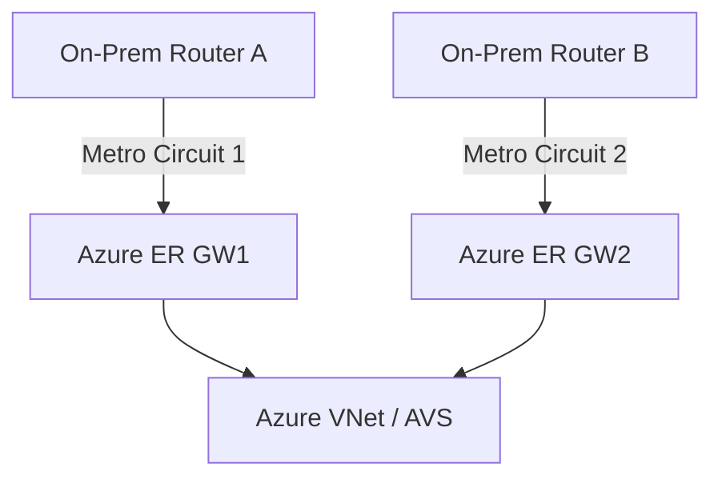
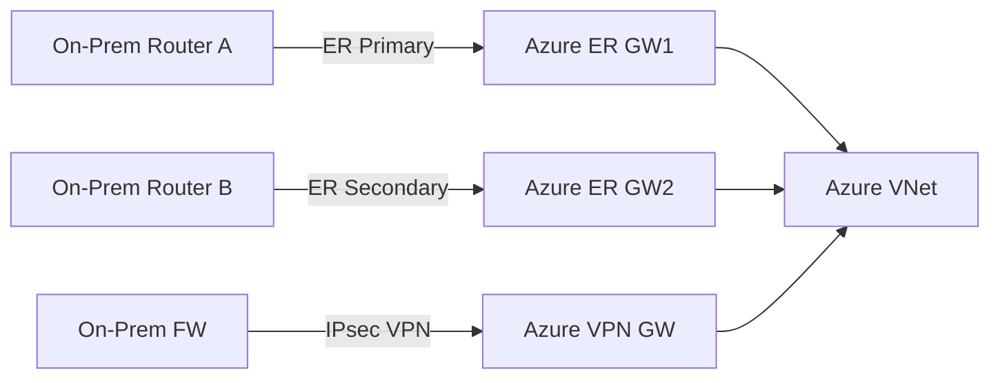
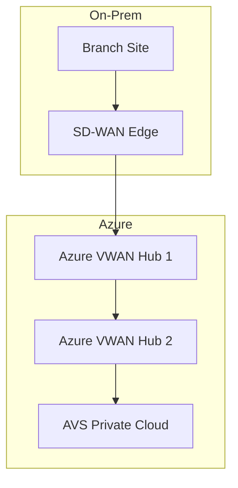
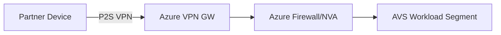

# Deep Dive: Azure Hybrid Connectivity to On-Premises with VPN + ExpressRoute

## Objective

Design a resilient, secure hybrid connectivity architecture using Azure VPN Gateway, ExpressRoute, and Azure VMware Solution (AVS), enabling both internal and external partner access under Zero Trust principles. This includes evaluating redundancy models, coexistence strategies, and multi-region high availability.

---

## 1. Azure Network Components Overview

| Component | Purpose |
| --------- | ------- |
|           |         |

| **VPN Gateway**        | Encrypted IPsec/IKE tunnels to on-premises networks                    |
| ---------------------- | ---------------------------------------------------------------------- |
| **ExpressRoute**       | Private, dedicated circuit for high-performance connectivity           |
| **Azure VWAN**         | Scalable network fabric with integrated SD-WAN and routing control     |
| **AVS (Azure VMware)** | Dedicated VMware stack hosted in Azure with native ExpressRoute access |
| **Azure Firewall/NVA** | Security perimeter enforcement in hub-and-spoke                        |

---

## 2. Use Case Scenario

- **Hybrid IT**: Cloud-hosted apps accessing on-prem systems (e.g., DBs, AD).
- **External Partner Access**: Limited VPN access to AVS workloads.
- **Zero Trust**: Least privilege access enforced with NSGs/ASGs/Firewall/NVA.

---

## 3. Redundancy and High Availability Models

### Option 1: ExpressRoute Only

#### a. Redundancy Design: Bow-tie

- **Redundant circuits in same metro**
- **Two ER gateways** (Active/Active)
- BGP used for dynamic routing
- SLA-backed: 99.95%

#### Pros:

- High throughput and consistent performance
- Private IP connectivity

#### Cons:

- No automatic failover to public transport (Internet)

---

### Option 2: ExpressRoute + VPN Failover (Recommended)

#### a. Redundancy Design: Square

- Dual ExpressRoute circuits (metro or geo-diverse)
- Site-to-site VPN configured as backup tunnel
- Azure Gateway supports coexistence of ER + VPN
- BGP weight/metric used to prefer ER; fallback to VPN

#### Pros:

- Increased resilience across underlay types (MPLS + Internet)
- Smooth failover with BGP convergence

#### Cons:

- VPN may not meet latency-sensitive workload requirements

---

### Option 3: ExpressRoute + Virtual WAN + Global Reach

- **Use VWAN hubs** in multiple regions
- **ER circuits** terminate into VWAN hubs
- **Global Reach** enables transitivity between on-prem locations
- Integrate SD-WAN at the edge

#### Sub-options:

- AVS integrated directly to VWAN via dedicated ER Gateways
- Internal + partner zones with NSG/UDR segmentation

---

## 4. AVS + Zero Trust Integration

- **AVS** uses ExpressRoute for L2 access to on-prem (no public Internet)
- Secure access via:
  - Azure Firewall/NVA in hub
  - Identity-driven access (AAD + Entra ID)
  - NSG/ASG to enforce East-West & North-South control
  - Just-In-Time (JIT) for ops
- **Partner Access**:
  - Through Point-to-Site VPN + conditional access policies
  - Scoped to AVS segment only

---

## 5. Design Considerations

- **Region Selection**: ER peering location proximity to AVS region
- **Gateway SKU**: Use Ultra Performance or ErGW3AZ for throughput & zone-resilience
- **Scale**: NVA with load balancers for active/active HA
- **Monitoring**: Azure Network Watcher, Connection Monitor, ER metrics
- **Cost**: ER Global Reach billed per GB; backup VPN is cost-effective but latent

---

## 6. Summary Recommendations

| Design Goal                   | Recommended Architecture                                     |
| ----------------------------- | ------------------------------------------------------------ |
| HA with SLA                   | Dual ExpressRoute (Bow-tie or Square), zone-redundant ER GWs |
| Resilience (underlay failure) | ER + VPN failover, BGP preference control                    |
| Multi-region access           | VWAN hubs + Global Reach                                     |
| Zero Trust enforcement        | Firewall/NVA + NSG/ASG + P2S VPN + Entra ID                  |
| Partner-controlled access     | P2S VPN to dedicated segment, scoped firewall rules          |
| AVS integration               | Dedicated ER gateway, NSX-T for East-West control            |

---

## References

- [erjosito GitHub](https://github.com/erjosito)
- [adstuart GitHub](https://github.com/adstuart)
- Azure documentation on [VPN Gateway Coexistence](https://learn.microsoft.com/en-us/azure/vpn-gateway/vpn-gateway-about-combined-features)
- Azure [VWAN architecture](https://learn.microsoft.com/en-us/azure/virtual-wan/virtual-wan-about)

