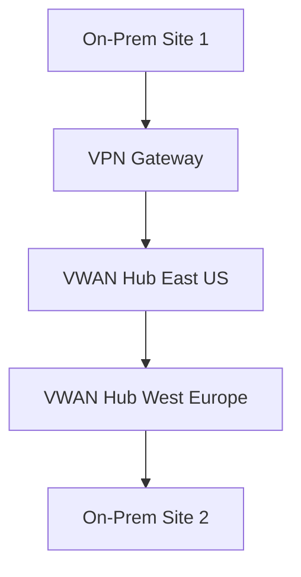

# Chapter 6: Global Transit and Virtual WAN

## Objective

Utilize Azure Virtual WAN (VWAN) to create a global, scalable, and secure transit architecture across regions and on-premises sites.

## 1. VWAN Architecture Overview

- **VWAN Hubs**
- **VWAN Hub-to-Hub Peering**
- **Integration with VPN/ER/SD-WAN**

## 2. SD-WAN Integration

- Direct branch-to-VWAN using NVA/SD-WAN appliances

## 3. Global Reach & Inter-hub Transitivity

- Use ER + Global Reach to provide seamless pathing

## 4. Security & Policy Control

- Secure Hub: Azure Firewall, routing policies, custom policies

## 5. Monitoring

- Connection Monitor, VWAN Insights, Log Analytics integration

