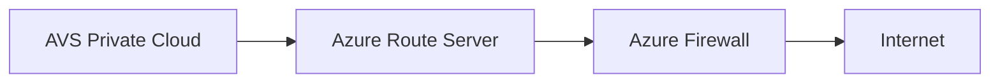

# Chapter 7: Azure as Internet Breakout for AVS

## Objective

Enable internet access for AVS workloads while maintaining secure egress control, routing predictability, and compliance with corporate security policies.

---

## 1. Common Deployment Pattern

- AVS → Azure Route Server → Azure Firewall or NVA → Internet
- UDR from AVS to route 0.0.0.0/0 to Azure Firewall
- Enforced via NSX-T for East-West and North-South segmentation

---

## 2. Security Controls

- Firewall DNS proxy (for AVS VMs with private DNS)
- URL filtering, TLS inspection
- Logging with Azure Monitor
- Integration with SIEM (e.g., Sentinel)

---

## 3. Zero Trust Enhancements

- Entra ID Conditional Access + Defender for Cloud
- Endpoint posture-based rules
- Egress breakout tagging (via ASG)

---

## 4. Design Considerations

| Area | Recommendation |
|------|----------------|
| Redundancy | Use Availability Zones for Azure Firewall |
| Scale | Autoscaling NVA/Firewall or multiple instances |
| Compliance | Central logging + NSG flow logs + activity logs |
