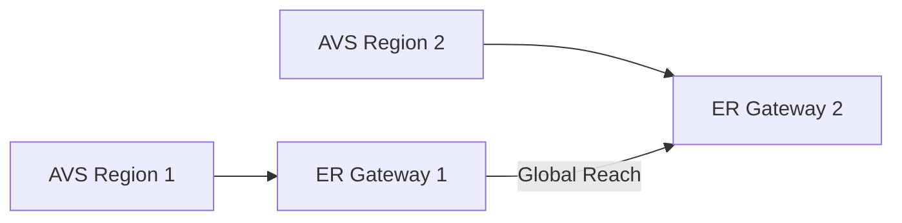
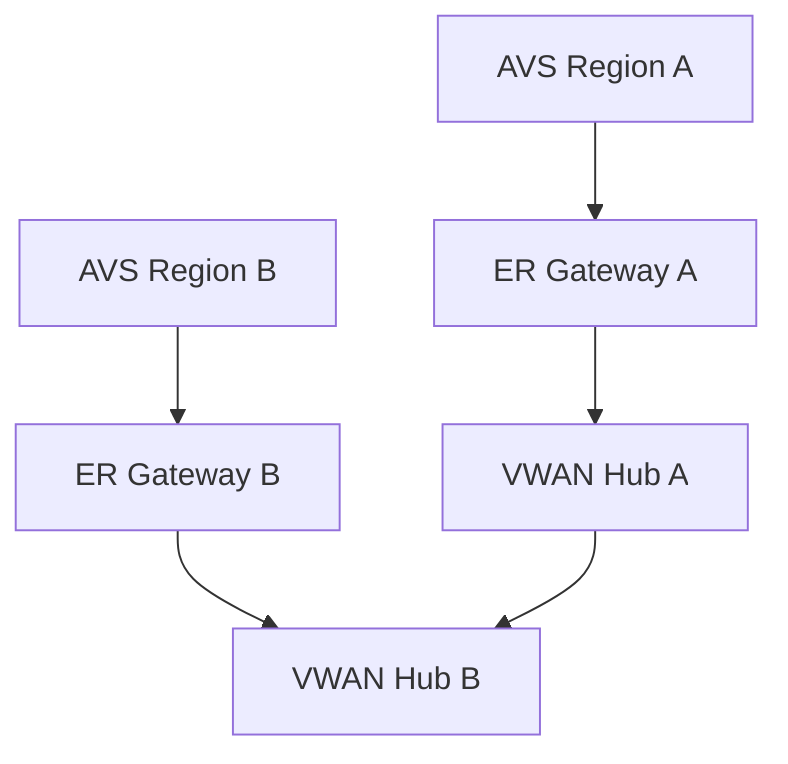

# Chapter 8: Multi-region Connectivity to AVS

## Objective

Design resilient, performant connectivity to Azure VMware Solution across regions using ExpressRoute and Azure Virtual WAN.

---

## 1. Topology Patterns

### Option A: ER Global Reach between AVS regions

### Option B: VWAN Hub-to-Hub with ER + SD-WAN

- AVS in each region connects to VWAN hub
- VWAN hubs peered for transitive connectivity

---

## 2. Routing Strategy

- Advertise only local AVS prefixes to VWAN or ER GW
- Use BGP community tags or filtering to limit propagation

---

## 3. Design Considerations

| Area | Recommendation |
|------|----------------|
| Traffic Optimization | Place AVS close to dependent apps |
| BGP Control | Prefer symmetric routing using MED/local-pref |
| Segmentation | Hub-and-spoke with NSG/UDR isolation |
