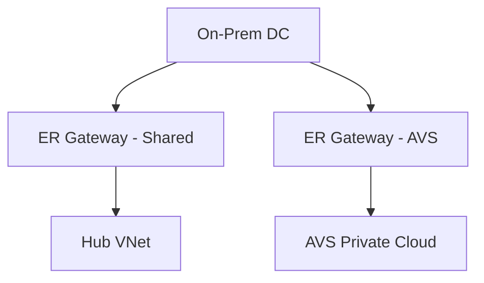

# Chapter 9: Dedicated ExpressRoute Gateways

## Objective

Use dedicated ExpressRoute Gateways for workloads like AVS to separate traffic, apply independent scaling, and enforce routing domains.

---

## 1. Use Case

- Customer has shared hub with many VNets + AVS needing strict boundary
- Avoid cross-talk by isolating ER Gateways

---

## 2. Topology

---

## 3. Design Benefits

| Benefit | Description |
|---------|-------------|
| Isolation | Route control and policy separation |
| Performance | Separate SKU scaling for AVS |
| Security | Independent NVA/Firewall domains |

---

## 4. Design Guidance

- Use ErGW3AZ for AVS
- Use different route tables in UDR
- Apply NSGs/ASGs at VNet boundaries
