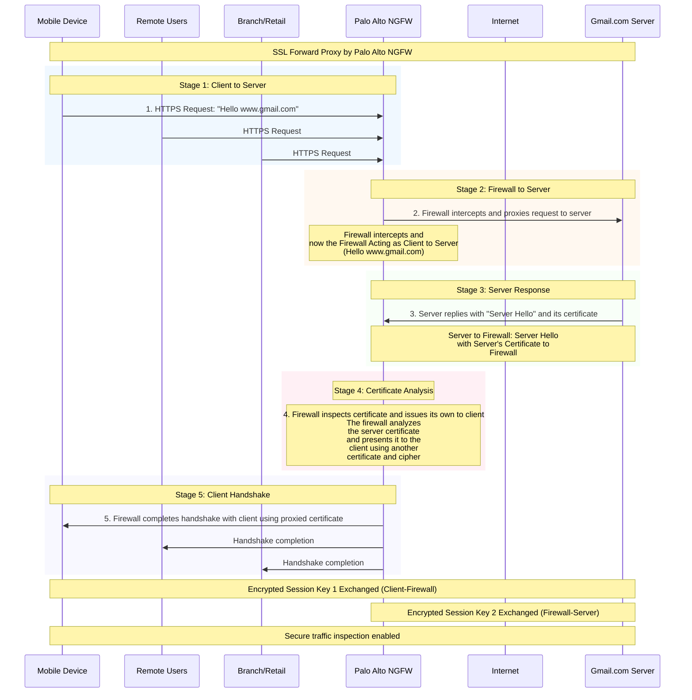

# Palo Alto SSL Forward Proxy - Secure Traffic Inspection

## Overview

The Palo Alto Next-Generation Firewall (NGFW) SSL Forward Proxy enables secure traffic inspection by acting as an intermediary between clients and servers. This process allows the firewall to decrypt, inspect, and re-encrypt SSL/TLS traffic for comprehensive security analysis while maintaining end-to-end encryption.

## Process Flow Diagram

5 Stages:
- Client to Server: HTTPS request initiation
- Firewall to Server: Interception and proxying
- Server Response: Server Hello and certificate delivery
- Certificate Analysis: Firewall inspection and certificate substitution
- Client Handshake: Completion with proxied certificate

Key Technical Details:
- Dual encrypted sessions for complete traffic inspection
- Certificate analysis and substitution process
- The firewall's role change from proxy to client
- Secure traffic inspection capabilities
  
## Architecture Components

### Client Devices
- **Mobile Devices**: Smartphones and tablets accessing internet resources
- **Remote Users**: Users connecting from external locations
- **Branch/Retail**: Corporate branch offices and retail locations

### Core Infrastructure
- **Palo Alto NGFW**: Central security appliance performing SSL forward proxy functions
- **Internet**: Public network infrastructure
- **Target Servers**: Destination servers (e.g., Gmail.com)

## SSL Forward Proxy Process - 5 Stages

### Stage 1: Client to Server Request
**Description**: Client sends HTTPS request
- Client device initiates HTTPS connection
- Request: "Hello www.gmail.com"
- All client types (Mobile, Remote Users, Branch/Retail) send requests through the firewall

### Stage 2: Firewall to Server Proxying
**Description**: Firewall intercepts and proxies the request to server
- **Key Function**: Firewall intercepts the original client request
- **Role Change**: Firewall now acts as client to the destination server
- **Action**: Forwards "Hello www.gmail.com" request to the actual server
- **Purpose**: Enables traffic inspection and control

### Stage 3: Server Response
**Description**: Server replies with "Server Hello" and its certificate
- **Server Action**: Target server responds with Server Hello message
- **Certificate Delivery**: Server provides its SSL certificate to the firewall
- **Firewall Reception**: NGFW receives and analyzes the server's certificate

### Stage 4: Certificate Analysis and Substitution
**Description**: Firewall inspects certificate and issues its own to client
- **Certificate Analysis**: Firewall examines the server's certificate for validity and security
- **Certificate Generation**: Firewall creates its own certificate to present to the client
- **Cipher Selection**: Determines appropriate cipher suite for client communication
- **Security Validation**: Ensures certificate meets security policies

### Stage 5: Client Handshake Completion
**Description**: Firewall completes handshake with client using proxied certificate
- **Certificate Presentation**: Firewall presents its generated certificate to the client
- **Handshake Completion**: SSL/TLS handshake completed between client and firewall
- **Session Establishment**: Secure communication channel established

## Encryption Key Management

### Dual Encryption Sessions
The SSL Forward Proxy establishes two separate encrypted sessions:

1. **Encrypted Session Key 1**: Client ↔ Firewall
   - Secures communication between client devices and the NGFW
   - Uses firewall-generated certificate

2. **Encrypted Session Key 2**: Firewall ↔ Server
   - Secures communication between NGFW and destination server
   - Uses original server certificate

## Security Benefits

### Traffic Inspection Capabilities
- **Malware Detection**: Identify and block malicious content in encrypted traffic
- **Data Loss Prevention**: Monitor and control sensitive data transmission
- **Application Control**: Enforce application usage policies
- **Threat Prevention**: Detect and prevent advanced threats hidden in SSL traffic

### Policy Enforcement
- **URL Filtering**: Apply web filtering policies to HTTPS traffic
- **File Blocking**: Prevent transfer of unauthorized file types
- **Content Inspection**: Deep packet inspection of decrypted content

## Implementation Considerations

### Certificate Management
- **Certificate Authority**: Requires trusted CA certificate installation on client devices
- **Certificate Validation**: Proper certificate chain validation
- **Certificate Policies**: Define certificate handling and validation rules

### Performance Impact
- **Processing Overhead**: Additional CPU utilization for encryption/decryption
- **Latency Considerations**: Slight increase in connection establishment time
- **Throughput Planning**: Capacity planning for SSL inspection loads

### Compliance and Privacy
- **Regulatory Compliance**: Ensure compliance with data protection regulations
- **Privacy Policies**: Implement appropriate privacy protection measures
- **Audit Requirements**: Maintain logs for compliance and forensic purposes

## Use Cases

### Enterprise Security
- **Remote Workforce**: Secure remote access and traffic inspection
- **Branch Office Protection**: Centralized security for distributed locations
- **BYOD Security**: Mobile device security and policy enforcement

### Threat Detection
- **Advanced Persistent Threats**: Detect sophisticated attacks using encrypted channels
- **Command and Control**: Identify malicious C&C communications
- **Data Exfiltration**: Prevent unauthorized data transmission

## Best Practices

### Deployment Guidelines
1. **Selective Decryption**: Apply SSL decryption selectively based on risk assessment
2. **Certificate Pinning**: Address certificate pinning challenges in applications
3. **Performance Monitoring**: Continuously monitor system performance and capacity
4. **Policy Tuning**: Regularly review and update security policies

### Security Considerations
1. **Certificate Security**: Protect firewall private keys and certificates
2. **Bypass Policies**: Define appropriate bypass rules for sensitive applications
3. **Logging and Monitoring**: Implement comprehensive logging for security events
4. **Regular Updates**: Keep firewall software and threat intelligence updated

## Conclusion

The Palo Alto SSL Forward Proxy provides essential visibility and control over encrypted traffic while maintaining security and performance. This 5-stage process enables organizations to inspect HTTPS traffic for threats while preserving end-to-end encryption through dual session keys. Proper implementation requires careful consideration of certificate management, performance impact, and compliance requirements.

## Appendix : 

### SSL Forward Proxy by Palo Alto NGFW

Diagram:
- All 5 stages of the SSL Forward Proxy process
- The dual encryption sessions (Key 1 and Key 2)
- Multiple client types (Mobile, Remote Users, Branch/Retail)
- The NGFW acting as an intermediary
- Certificate handling and analysis

~~~
sequenceDiagram
    participant Mobile as Mobile Device
    participant RU as Remote Users
    participant BR as Branch/Retail
    participant NGFW as Palo Alto NGFW
    participant Internet as Internet
    participant Server as Gmail.com Server

    Note over Mobile, Server: SSL Forward Proxy by Palo Alto NGFW
    
    rect rgb(240, 248, 255)
        Note over Mobile, NGFW: Stage 1: Client to Server
        Mobile->>NGFW: 1. HTTPS Request: "Hello www.gmail.com"
        RU->>NGFW: HTTPS Request
        BR->>NGFW: HTTPS Request
    end

    rect rgb(255, 248, 240)
        Note over NGFW, Server: Stage 2: Firewall to Server
        NGFW->>Server: 2. Firewall intercepts and proxies request to server
        Note over NGFW: Firewall intercepts and now the Firewall Acting as Client to Server (Hello www.gmail.com)
    end

    rect rgb(248, 255, 248)
        Note over Server, NGFW: Stage 3: Server Response
        Server->>NGFW: 3. Server replies with "Server Hello" and its certificate
        Note over NGFW, Server: Server to Firewall: Server Hello with Server's Certificate to Firewall
    end

    rect rgb(255, 240, 245)
        Note over NGFW: Stage 4: Certificate Analysis
        Note over NGFW: 4. Firewall inspects certificate and issues its own to client The firewall analyzes the server certificate and presents it to the client using another certificate and cipher
    end

    rect rgb(248, 248, 255)
        Note over NGFW, Mobile: Stage 5: Client Handshake
        NGFW->>Mobile: 5. Firewall completes handshake with client using proxied certificate
        NGFW->>RU: Handshake completion
        NGFW->>BR: Handshake completion
    end

    Note over Mobile, Server: Encrypted Session Key 1 Exchanged (Client-Firewall)
    Note over NGFW, Server: Encrypted Session Key 2 Exchanged (Firewall-Server)
    
    Note over Mobile, Server: Secure traffic inspection enabled
~~~
---
*source: Palo Alto NGFW SSL Forward Proxy documentation and diagram analysis*
